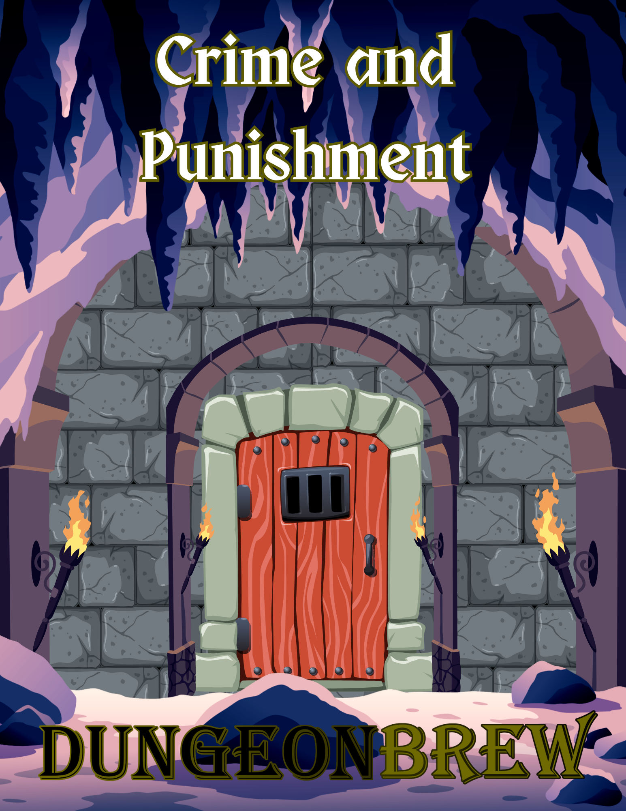

# Crime & Punishment

A system for laws, crimes, and punishments that adds depth, realism, and consequence to your game. Whether your setting is a grimdark fantasy realm, a medieval kingdom, or a sprawling urban empire, having clear rules for how justice is meted out enriches the role-playing experience. Punishments are based on medieval practices — which usually involved torture — so be warned.

### Download the PDF

<a href="../downloads/crime_and_punishment.pdf" download class="md-button">Download Crime & Punishment</a>

## Why Include Crimes and Punishments?

**Realism and Immersion.** A well-defined legal system makes your world feel lived-in and believable. Players understand that their actions have consequences within the game's society.

**Role-playing Opportunities.** Characters can interact with the legal system in various ways, whether as law-abiding citizens, criminals, or enforcers of justice. It allows for rich storytelling and character development.

**Narrative Tension.** The threat of punishment can create tension and stakes in the narrative. Whether your PCs are fleeing from the law, trying to clear their names, or serving as judges and executioners, the legal system can drive the plot forward.

## Caveats and Considerations

**Player Expectations.** Be clear with your players about the role the legal system will play in your game. If they're expecting high adventure and swashbuckling, they might not enjoy spending multiple sessions dealing with a trial.

**Narrative Flexibility.** The law in your game doesn't have to be inflexible. Corrupt officials, loopholes, or even divine intervention can all add complexity to how justice is served.

**Sensitive Topics.** Be mindful of your players' comfort levels. Some crimes, particularly those involving violence or coercion, can be sensitive topics. Ensure that the inclusion of such elements is done thoughtfully and with the consent of everyone at the table.

## Balancing Realism with Fun

**Adapt to Your Setting.** The severity of crimes and their corresponding punishments should reflect the culture and values of the setting. In a harsh, authoritarian society, punishments might be brutal and swift, whereas a more democratic setting might emphasize fines or imprisonment.

**Scale Punishments.** Not every crime needs to be met with a death sentence. Ensure there's a range of punishments, from fines and public shaming to corporal and capital punishment, allowing for different levels of consequences.

**Player Agency.** Allow players some level of agency when it comes to interacting with the legal system. Maybe they can bribe officials, argue their case in a trial, or stage a prison break. The legal system should be a challenge, not an insurmountable barrier.

---

## Common Crimes and Punishments

**Crimes Against People** includes assault, murder, and kidnapping. Punishments may range from fines and imprisonment to execution for the most severe offenses.

**Crimes Against Fair Trade** covers theft, arson, and fraud. Punishments often include restitution, fines, branding, and sometimes physical punishment or forced labor.

**Crimes Against Government** encompasses treason, sedition, and espionage — serious offenses against the state, often punished by death or severe corporal punishment.

**Crimes Against the Gods** addresses blasphemy, heresy, and sacrilege, which can result in punishments ranging from public flogging to execution or excommunication in a world where deities are real and active.

**Crimes Involving Magic** covers unauthorized or dangerous use of magic, which might lead to fines, imprisonment, or even death, particularly for dark or forbidden magic.

---

## Crimes Against People

| Crime | Description |
|---|---|
| **Adultery** | If a person commits adultery, the person is to be fined a standard month's wages. If a person commits a second offense, the person is to be fined two standard month's wages and branded an adulterer. |
| **Assault** | If a person commits acts of aggressive violence against another, the person is to be fined a standard month's wages and the cost of the treatment of the victim. |
| **Brawling** | If a person commits acts of violence against another, the person is to be fined a standard week's wages. |
| **Deadly Assault** | If a person commits acts of aggressive violence with a deadly weapon, the person is to be fined three standard month's wages, the cost of the treatment of the victim, and confined to a sweatbox for three days. |
| **Kidnapping** | If a person commits a kidnapping, the person is to be imprisoned with hard labor and fined a standard month's wages. |
| **Mass Murder** | If a person commits murder against multiple people, the person is to be executed by breaking on the wheel. |
| **Murder** | If a person commits murder, the person is to be executed by beheading. |
| **Rape** | If a person commits a rape, the person is to be executed by burning. |
| **Slavery** | If a person engages in slavery, the person is to be confined to hard labor. |
| **Torture** | If a person commits torture, the person is to be fined three standard month's wages and sentenced to mutilation in a similar fashion as inflicted upon the victim. |

## Crimes Against Fair Trade

| Crime | Description |
|---|---|
| **Arson** | If a person commits arson, the person is to be fined three standard month's wages plus any damages. Additional offenses can result in flogging, fines, branding, and mutilation. |
| **Black Marketry** | If a person commits acts of black marketry, the person is to be fined three months standard wages and branded as a Thief. Additional offenses can result in flogging, fines, branding, and mutilation. |
| **Dishonesty** | If a person commits acts of dishonesty in business or government dealing, such as false scales, fake coins-gems-treasure, the person is to be fined the value of the damages and sentenced to hard labor for the remainder. |
| **Oath-Breaking** | If a person breaks a sworn oath in a business dealing, the oath-breaker is to be fined three standard month's wages and sentenced to public bastinado. |
| **Property Damage** | If a person steals or damages property, the person is to be fined three standard month's wages plus any damages. |
| **Thievery** | If a person commits acts of thievery, the person is to be fined twice the value of the goods stolen and branded on their right hand. Additional offenses can result in flogging, fines, branding, and mutilation. |

## Crimes Against Government

| Crime | Description |
|---|---|
| **Assault Against an Official** | If a person commits acts of aggression against an official, the person is to be fined three standard month's wages, confined to a sweatbox for three days, and publicly flogged. |
| **Blackmail, Bribery, or Forgery** | If a person commits false testimony, blackmail, bribery, or forgery as it relates to an official of the government, they are to be fined three standard month's wages and sentenced to inhalation of smelter fumes. |
| **Curfew or Weapon not Peace-Bound** | If a person is out after curfew, the person will be fined a standard week's wages. Additional offenses can result in fines, birching, or lashing. |
| **Desertion During War** | If a soldier deserts the army during wartime, the deserter is to be sentenced to death by hanging or firing squad, and their name dishonored in public records. |
| **Espionage** | If a person is caught spying or passing information to enemies of the state, the person is to be sentenced to death by hanging, and all assets are to be confiscated by the state. |
| **Impersonation or Interference** | If a person impersonates or interferes with the watch, army, or official government representation in the carrying out of duties, the person will be fined a standard week's wages and sentenced to public horse. |
| **Insurrection** | If a person engages in or leads an armed uprising or violent resistance against the state or its officers, the person is to be sentenced to death by hanging or firing squad. Additional punishments may include the confiscation of assets and the execution or imprisonment of co-conspirators. |
| **Minor Crimes** | A person committing minor crimes (e.g., public intoxication, disrupting the peace, indecent conduct, littering, public nudity, etc.) is to be fined a minimum of a standard week's wages. |
| **Oath-breaking** | If a person breaks a sworn oath in a government dealing that does not include desertion during war-time, the oath-breaker is to be branded and fined three standard month's wages. |
| **Sedition** | If a person organizes or incites rebellion or civil disorder against the state's authority, the person is to be fined three standard month's wages and sentenced to public flogging. For repeat or severe offenses, the penalty may escalate to branding, imprisonment, or execution by hanging. |
| **Tax Evasion** | If a person deliberately avoids paying taxes owed to the government or local authority, the person is to be fined double the amount of the unpaid taxes and publicly whipped. For repeated or severe offenses, they are to be fined an additional three standard month's wages as a penalty and sentenced to time in the stocks for one week. |
| **Treason** | If a person betrays the state by aiding its enemies or committing acts that directly harm the state, such as attempting to overthrow the ruler or conspiring against the government, the person is to be executed by public torture, typically through beheading, burning, or breaking on the wheel. The traitor's family may also face repercussions, such as the loss of titles, lands, and wealth. |

## Crimes Against the Gods

| Crime | Description |
|---|---|
| **Blasphemy or Heresy** | If a person perniciously speaks ill of the gods, the person is to be placed in a cangue for a week, publicly flogged, and fined a standard month's wages. |
| **Desecration of Holy Artifacts** | If a person defiles or destroys a holy artifact, the person is to be sentenced to a month of fasting and prayer under the supervision of the clergy, and branded on the forehead with a symbol of their crime. Any further offenses will result in excommunication and banishment. |
| **Religious Violation** | If a person violates the sanctity of a chapel, temple, or monastery, the person is to be birched and fined a standard week's wages. |
| **Sacrilege** | If a person commits an act of sacrilege, such as defiling a temple or holy site, the person is to be branded on the forehead with a symbol of their crime and fined three standard month's wages. |
| **Unauthorized Worship** | If a person worships a deity that is not sanctioned by the state or recognized by the established religion, the person is to be fined two standard month's wages and publicly whipped. |

---

## Crimes Involving Magic

| Crime | Description |
|---|---|
| **Animating the Dead** | If a person uses magic to animate the dead, the person is to be sentenced to burning. |
| **Deadly Magic Use** | If a person uses deadly magic in a non-magic use area or without a license, the person is to be fined three standard month's wages and placed in the pillory or stocks for three days. |
| **Deadly Magic Use (Injury)** | If a person uses deadly magic, the person is to be sentenced to mutilation of the hands and tongue, branded, and banished. |
| **Destructive Magic Use** | If a person uses destructive magic, the person is to be fined three standard month's wages plus any damages, and branded with a symbol of their crime. Additional offenses can result in flogging, fines, or banishment. |
| **Magic Use** | If a person uses magic in a non-magic use area or without a license, the person is to be fined a standard month's wages. |
| **Magical Forgeries or Cursed Items** | If a person creates or deals in magical forgeries or cursed items, the person is to be fined three standard month's wages and branded on their right cheek. Additional offenses can result in flogging, fines, branding, and mutilation. |
| **Mind-Controlling Magic Use** | If a person uses mind-controlling magic, the person is to be branded, sentenced to mutilation of the hands and tongue, and fined three standard month's wages. |
| **Unreported Possession** | Any magical item of Rare or Higher quality that is not documented will be confiscated and the owner fined 1/10th the value of the item. Upon payment, the item will be returned if it is not a danger to others. |
| **Dark Magic Use** | If a person practices dark or forbidden magic, such as necromancy or curses, they are to be sentenced to death by burning at the stake. For minor offenses, the person is to be branded and banished. |
| **Summoning Malicious Entities** | If a person summons malicious entities that cause harm to the populace, they are to be sentenced to death by hanging or burning, and their remains are to be interred in unhallowed ground. |

---

## Punishments

| Punishment | Description | Save | Effect |
|---|---|---|---|
| **Banishment** | The offender is forced to leave their home and go abroad or to another region either permanently or for a fixed period of time. | — | Banished, usually under pain of death |
| **Bastinado** | The offender is beaten on the soles of their feet with a stick. The soles of the feet are particularly sensitive, making this punishment extremely painful with long-lasting damage. | Con 15 — Half Duration | Half movement speed 3d10 days |
| **Beheading** | Beheading with a sword or an axe may be more merciful than hanging, but that is not always the case. Sometimes several blows are needed to sever the person's head. | — | Death |
| **Birching** | The offender is beaten across the backside with twigs or thin rods. Birching as a punishment for minor crimes is common, often used as a public spectacle to deter others. | — | 1d4 damage |
| **Boiling Alive** | Traditionally reserved for severe crimes like poisoning, the offender is placed in a large cauldron of boiling liquid until death. Known for its extreme cruelty and slow execution. | — | Death |
| **Branding** | Branding with red-hot irons is a very old punishment. It can be used for various crimes and leaves a permanent mark to signify the offender's guilt. | — | 1d4 damage and disadvantage to Charisma checks |
| **Breaking on the Wheel** | The offender is tied to a wheel, and the executioner uses an iron bar or hammer to break each arm and leg in several places. Sometimes a final blow to the chest or strangulation ends their suffering, though they might be left to die slowly. | — | Death |
| **Burning** | Burning is traditionally the penalty for heresy or murder. The execution can be carried out while the offender is alive, or they may be hanged first to spare them the agony. | — | Death |
| **Cangue** | A wooden board is locked around the offender's neck, rendering them unable to reach their mouth with their hands, preventing them from eating or drinking without assistance. | Con 15 — Half Duration | Cannot eat or drink without assistance. Possible Exhaustion Levels |
| **Crank** | The offender is forced to turn a handle repeatedly, often a specified number of times or for a specified period, especially before being allowed to eat or drink. | — | Imprisonment, set period of time |
| **Drowning** | Although drowning is an obvious method of execution, it is seldom used due to its perceived cruelty. Traditionally reserved for those deemed unworthy of more "honorable" forms of death. | — | Death |
| **Fines** | Forcing people to pay money is a common method of punishment, often used in conjunction with other penalties. The amount is typically proportionate to the crime and the offender's means. | — | Variable monetary loss |
| **Firing Squad** | A group of shooters is assembled to execute the offender by firing bullets. Considered more merciful than other forms of execution but still used to make an example of the criminal. | — | Death |
| **Flogging** | A whip or similar device is used to lash the offender, inflicting pain and injury as a form of corporal punishment. | Con (5 + Lashes) — Avoid Con Damage | 1 damage per lash. 1 Con damage per 10 lashes |
| **Hard Labor** | The offender is imprisoned and forced to perform laborious tasks, such as mining, smelting, or construction, without recompense. | — | Imprisonment, set period of time |
| **Horse** | The offender is made to sit on a wooden "horse," a sharp-edged device, with their legs on either side and their arms tied behind their back. Weights are tied to their legs, causing extreme pain. | Con 15 — Half Duration | Half movement speed 6d10 days |
| **Inhalation of Smoke** | The offender's head is held over a fire or smelting furnace, forcing them to inhale thick, noxious fumes. This can cause lasting damage to the lungs and other internal organs. | Con 15 — Half Duration | Penalty (1d4) to Con for 2d10 days |
| **Mutilation** | Mutilation includes blinding, cutting off hands, ears and noses or cutting out the tongue. Hands are traditional for stealing or poaching, whereas others might be common for lying or gossiping. | — | Imprisonment, set period of time |
| **Oubliette** | The offender is placed in a deep pit or small cell with no light or means of escape. The term comes from the French word "oublier," meaning "to forget," reflecting that prisoners are often left to die. | — | Imprisonment until death |
| **Picket** | The offender is suspended by their wrist, with one foot placed on a pointed but not sharp wooden stake. Over time, the wrist becomes tired, forcing more weight onto the stake. | Dex 15 — Avoid dislocation | Possible dislocation and half movement speed 4d10 days |
| **Pillory and Stocks** | The pillory is a wooden frame on a pole with holes for the offender's head and hands. The stocks serve a similar purpose for the feet. The offender is subjected to public ridicule. | — | Imprisonment, set period of time |
| **Pressing** | A wooden board is placed on the offender's body, and stone or iron weights are added until the person agrees to plead — or dies under the pressure. Used when a person refuses to plead. | Str Save (Variable) — Half Duration | Penalty (1d4) to Con for 4d10 days and possible death |
| **Scold's Bridle** | A metal frame placed over an offender's head, with a bit that sticks into their mouth to prevent talking. Used to silence those guilty of slander or other speech-related crimes. | — | Cannot eat or speak until removed |
| **Slavery** | The offender is forced into slavery, performing labor without compensation. Historically used for those who committed severe crimes or were captured in conflict. | — | Imprisonment, set period of time |
| **Stoning** | A crowd throws stones at the offender until they are dead. Often reserved for severe moral or religious crimes. | — | Death |
| **Sweatbox** | A cramped, enclosed space where the offender is locked in, causing them to overheat and dehydrate, potentially leading to severe health issues or death. | Con (Variable) — Avoid Death | Penalty (1d4) to Con for 1d10 days and possible death |
| **Whirligig** | A wooden cage mounted on a pivot, where the prisoner is placed and spun around until they become nauseous and vomit. Often used as a form of disorienting punishment. | Con 15 — Half Duration | Penalty (1d4) to Con for 1d10 days |
