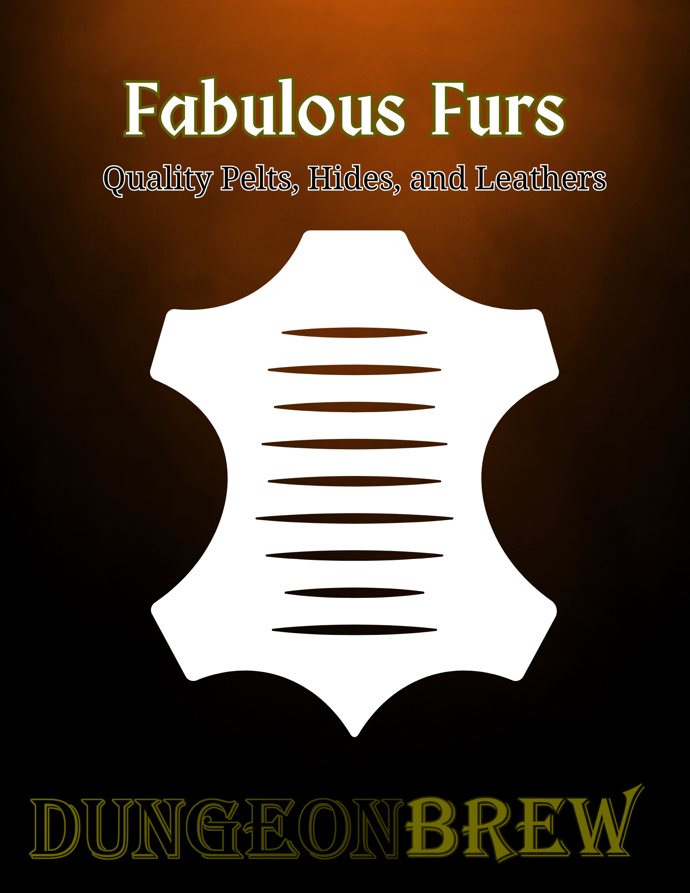

# Fabulous Furs

Fabulous Furs is a comprehensive price list for animal furs, hides, and leathers. It provides detailed values for a wide variety of animal pelts to add depth to your game's economy.

The system uses a three-tier quality rating (Poor, Average, and Pristine) to create significant value for prized pelts, with pristine pelts almost always being collected in the winter. The tables are organized by animal type and alphabetized for quick reference during a game.

### How to Use This Guide

**For Loot.** Generate more varied treasure. Finding a "pristine sable pelt" is more memorable than its equivalent value in coin.

**For Economy.** Create a market for PCs and NPCs who are trappers, crafters, or merchants.

**For World-Building.** Use the different types of furs and their values to show social status or reflect the local wildlife of a region.

### Download the PDF

<a href="../downloads/fabulous_furs.pdf" download class="md-button">Download Fabulous Furs (PDF)</a>

---

## Bear

A large, heavy hide with thick, shaggy fur, valued more for its imposing size and insulating properties than for fine texture.

**Black.** A dense, medium-length pelt of coarse, uniformly black fur, sometimes with a brown muzzle or a small white chest patch.

**Brown.** A large, heavy hide with long, shaggy fur. Color varies widely from blonde to dark brown, often with distinctive silver-tipped guard hairs on the shoulders and back.

**White.** A dense, heavy pelt of white to yellowish-white fur, comprised of a thick undercoat and long, oily, water-repellent guard hairs.

| Fur/Hide | Poor (0.5x) | Average (1x) | Pristine (3x) |
|:---|:---:|:---:|:---:|
| Bear, Black | 35 sp | 70 sp | 210 sp |
| Bear, Brown | 60 sp | 120 sp | 360 sp |
| Bear, White | 80 sp | 160 sp | 480 sp |

---

## Canine

**Coyote / Jackal.** A pelt of long, coarse guard hairs over a softer undercoat, typically in grizzled shades of grey, yellow, and reddish-brown.

**Dhole.** A dense pelt of short, coarse, reddish fur, typically uniform in color with a paler underside.

**Dog.** A highly variable, utilitarian hide. Fur is typically short and coarse, with common colors being mottled brown, black, or tan.

**Fox.** A soft, lustrous pelt with a dense undercoat, long guard hairs, and a characteristically bushy tail. The value is highly dependent on the color variant.

- **Arctic.** The winter coat is thick and uniformly pure white. The less common "blue" phase is a smoky, bluish-grey.
- **Cross.** A color variant of the red fox, featuring a prominent dark stripe running down its back and across its shoulders, forming a "cross" pattern.
- **Red.** A classic pelt of reddish-orange fur with a white underside, black fur on the lower legs, and often a white-tipped tail.
- **Silver.** A black color variant of the red fox, prized for its glossy black fur interspersed with white-tipped guard hairs that give it a silvered appearance.

**Wolf.** A large, durable pelt with long, coarse guard hairs over a dense, wooly undercoat. Color is typically a grizzled grey, but can range from pure white to solid black.

| Fur/Hide | Poor (0.5x) | Average (1x) | Pristine (3x) |
|:---|:---:|:---:|:---:|
| Coyote / Jackal | 4 sp | 8 sp | 24 sp |
| Dhole | 5 sp | 10 sp | 30 sp |
| Dog | 1 sp | 2 sp | 6 sp |
| Fox, Arctic | 18 sp | 36 sp | 108 sp |
| Fox, Cross | 12 sp | 24 sp | 72 sp |
| Fox, Red | 8 sp | 16 sp | 48 sp |
| Fox, Silver | 20 sp | 40 sp | 120 sp |
| Wolf | 5 sp | 10 sp | 30 sp |

---

## Feline

**Bobcat / Wildcat.** A short, dense, soft pelt with a greyish or reddish-brown coat marked with dark spots and bars.

**Cheetah.** A coarse, relatively thin pelt with a tawny coat covered in solid black spots. Often identified by the black "tear stripe" markings on the face.

**Cougar.** A pelt with a uniform, unmarked coat of short, coarse fur, typically in tawny-beige or greyish-brown.

**Jaguar.** A large pelt with a golden-yellow coat marked with prominent dark rosettes, which often contain a small, central dot.

**Leopard.** A sleek, soft pelt prized for its pattern. The value and appearance vary by the specific type.

- **Common Leopard.** A pale yellow to golden coat marked with small, densely packed dark rosettes that lack a central dot.
- **Snow Leopard.** A long, dense, and woolly pelt with a smoky-grey coat marked with large, open, dark-grey rosettes.

**Lion.** A large, short-haired pelt of uniform tawny-gold. The male is distinguished by its mane of long, coarse hair ranging from blonde to black.

**Lynx.** A thick, silky pelt of frosted grey or pale brown fur, often faintly spotted. Known for its long ear tufts and facial ruff.

**Ocelot.** A sleek, smooth pelt with a creamy or tawny coat marked with chain-like rings, spots, and stripes.

**Panther.** The rare, melanistic (all black) pelt of a jaguar or leopard. The coat is a uniform, glossy black, though the underlying rosette pattern is often faintly visible in certain light.

**Tiger.** A large pelt of short, dense fur with a reddish-orange to ochre coat marked with vertical black stripes.

| Fur/Hide | Poor (0.5x) | Average (1x) | Pristine (3x) |
|:---|:---:|:---:|:---:|
| Bobcat / Wildcat | 10 sp | 20 sp | 60 sp |
| Cheetah | 90 sp | 180 sp | 540 sp |
| Cougar | 60 sp | 120 sp | 360 sp |
| Jaguar | 100 sp | 200 sp | 600 sp |
| Leopard | 125 sp | 250 sp | 750 sp |
| Leopard, Snow | 175 sp | 350 sp | 1,050 sp |
| Lion | 150 sp | 300 sp | 900 sp |
| Lynx | 25 sp | 50 sp | 150 sp |
| Ocelot | 20 sp | 40 sp | 120 sp |
| Panther | 120 sp | 240 sp | 720 sp |
| Tiger | 175 sp | 350 sp | 1,050 sp |

---

## Hoofed Animals

**Antelope / Gazelle.** A hide with very short, fine hair on a supple skin. The coat is typically a shade of tan or grey, often with white markings on the belly and face.

**Bison.** A thick hide with long, shaggy, dark brown fur around the head and shoulders that shortens towards the rear.

**Boar / Pig.** A tough, thick hide covered in stiff, coarse bristles, known for producing durable leather.

**Chamois.** A hide with a short, dense coat, known for producing a uniquely soft, supple, and absorbent leather.

**Deer.** A pliable hide with a coat of short, often hollow, hair. Colors range from grey to reddish-brown, and it is commonly used to produce soft buckskin.

**Goat.** A flexible hide with a coat of straight, coarse hair, used for producing pliable leather and parchment.

**Horse / Cow.** A large, heavy hide with a coat of short, sleek hair. Its primary value is in producing large, smooth sheets of strong leather.

**Moose / Elk.** A large and heavy hide with a thick, coarse coat of dark brown or grey hair. Produces thick, durable leather.

**Reindeer / Caribou.** A hide with a dense undercoat and long, hollow guard hairs that trap air, providing superior insulation. The coat is typically brown and grey with a white neck.

**Sheep.** A hide with thick, woolly fleece known for its insulation.

| Hides/Leathers | Poor (0.5x) | Average (1x) | Pristine (3x) |
|:---|:---:|:---:|:---:|
| Antelope / Gazelle | 3 sp | 6 sp | 18 sp |
| Bison | 12 sp | 24 sp | 72 sp |
| Boar / Pig | 2 sp | 4 sp | 12 sp |
| Chamois | 3 sp | 6 sp | 18 sp |
| Deer | 4 sp | 8 sp | 24 sp |
| Goat | 2 sp | 4 sp | 12 sp |
| Horse / Cow | 3 sp | 6 sp | 18 sp |
| Moose / Elk | 10 sp | 20 sp | 60 sp |
| Reindeer / Caribou | 6 sp | 12 sp | 36 sp |
| Sheep | 2 sp | 4 sp | 12 sp |

---

## Weasel

**Badger.** A durable pelt with long, coarse, silver-tipped guard hairs over a paler undercoat, creating a grizzled grey-and-black appearance.

**Fisher.** A pelt of long, dense, dark brown to black fur, often with a frosted, grizzled appearance on the head and shoulders.

**Marten.** A group of related animals prized for their soft, dense pelts of rich brown fur, representing a significant tier in the luxury fur trade.

- **Beech (Foynes).** A high-quality brown pelt with a distinctive white throat patch, often slightly coarser than Pine Marten fur.
- **Pine.** A soft, dense pelt of rich brown fur that lightens to a pale, yellowish patch on the throat.

**Mink.** A soft, sleek, and glossy pelt. The fur is short, dense, and typically a uniform, deep chocolate-brown.

**Otter (Sea & River).** A pelt with extremely dense, waterproof underfur and sleek, glossy guard hairs. Typically a rich, dark brown.

**Polecat (Fitch).** A pelt with long, dark guard hairs over a yellowish or creamy undercoat, creating a distinct two-toned appearance.

**Sable.** The most luxurious fur, with fine, silky, and dense fur of a uniform, deep brown or black.

**Stoat (Ermine).** The pure white winter coat of the stoat is the most valuable, distinguished by its softness and the signature black tip of the tail.

**Weasel.** The smallest members of the family, with thin pelts whose value is highly dependent on the season and species, ranging from common brown fur to white.

- **Common.** A very small, thin pelt with short fur, typically reddish-brown in its summer coat.
- **Lettice (White).** The white winter coat of a common weasel, used as a lower-quality alternative to Ermine as it lacks the black tail tip.

**Wolverine.** A long, coarse, and durable pelt, typically dark brown with distinctive pale stripes running along its sides.

| Fur/Hide | Poor (0.5x) | Average (1x) | Pristine (3x) |
|:---|:---:|:---:|:---:|
| Badger | 4 sp | 8 sp | 24 sp |
| Fisher | 30 sp | 60 sp | 180 sp |
| Marten, Beech (Foynes) | 35 sp | 70 sp | 210 sp |
| Marten, Pine | 40 sp | 80 sp | 240 sp |
| Mink | 75 sp | 150 sp | 450 sp |
| Otter (Sea & River) | 25 sp | 75 sp | 225 sp |
| Polecat (Fitch) | 8 sp | 16 sp | 48 sp |
| Sable | 200 sp | 400 sp | 1,200 sp |
| Weasel, Ermine (Stoat) | 165 sp | 330 sp | 990 sp |
| Weasel (Common) | 2 sp | 4 sp | 12 sp |
| Weasel, Lettice (White) | 5 sp | 10 sp | 30 sp |
| Wolverine | 20 sp | 40 sp | 120 sp |

---

## Rodent

**Beaver.** A pelt prized for its dense, soft, and waterproof underfur, which is covered by longer, glossy brown guard hairs.

**Chinchilla.** A pelt of dense and soft fur with a velvety texture. The coat is typically a silvery or bluish-grey, fading to a white belly.

**Dormouse.** A very small and delicate pelt with soft, fine fur, typically grey or tawny-brown in color.

**Marmot.** A thick, durable pelt of dense, somewhat coarse fur, typically yellowish-brown or grey in color.

**Muskrat / Nutria.** A waterproof pelt with coarse, dark brown guard hairs protecting a dense, soft undercoat. Used as a less expensive alternative to beaver or otter.

**Rabbit (Coney) / Hare.** A soft pelt, though not very durable. Colors are typically mottled shades of brown, grey, or white.

**Squirrel.** A small, thin pelt whose appearance and value are highly dependent on the season and color.

- **Gris (Winter Grey).** The grey back fur of the squirrel in its prime winter coat, used as a standard lining material.
- **Red (Summer).** The reddish-brown fur of the squirrel's less dense summer coat, considered lower in quality than the winter pelt.
- **Vair (Patterned).** A decorative pattern, not a natural pelt, assembled by sewing the grey back fur (gris) and white belly fur into alternating checkerboard or wavy panels.

| Fur/Hide | Poor (0.5x) | Average (1x) | Pristine (3x) |
|:---|:---:|:---:|:---:|
| Beaver | 15 sp | 30 sp | 90 sp |
| Chinchilla | 10 sp | 20 sp | 60 sp |
| Dormouse | 1 sp | 2 sp | 6 sp |
| Marmot | 2 sp | 4 sp | 12 sp |
| Muskrat / Nutria | 3 sp | 6 sp | 18 sp |
| Rabbit (Coney) / Hare | 1 sp | 2 sp | 6 sp |
| Squirrel, Gris (Winter Grey) | 1 sp | 2 sp | 6 sp |
| Squirrel, Red (Summer) | 5 cp | 1 sp | 3 sp |
| Squirrel, Vair (Patterned) | 2 sp | 4 sp | 12 sp |
