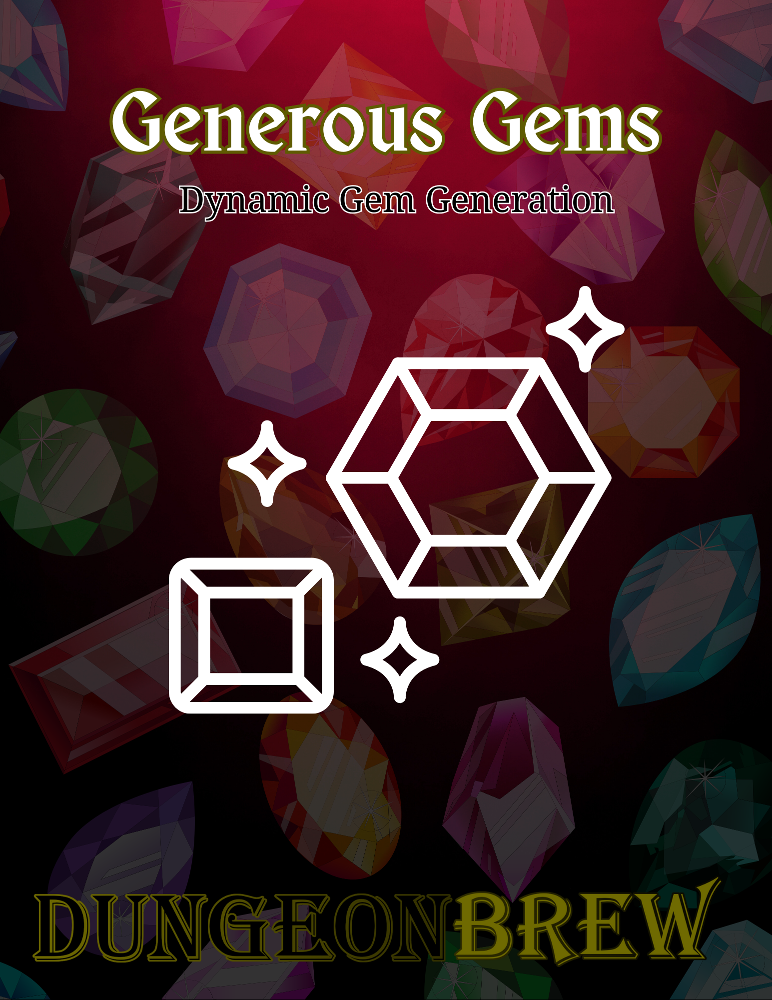

# Generous Gems

Generous Gems is a dynamic gem generation system designed to add depth and variety to your treasure. Rather than treating gems as stylized currency — a diamond is a diamond is a diamond — this generator produces unique stones with specific types, qualities, and sizes that make each find memorable.

### How It Works

Generating a gem is a three-step process:

**Gem Type (d100).** A roll determines the stone's type from a list of 58 possibilities. This provides the gem's Base Value.

**Gem Quality (2d10).** A roll determines the gem's quality, from Flawed to Flawless. This provides a Quality Multiplier.

**Carat Size (Cascading d4).** A cascading d4 roll determines the gem's physical size, weighted toward smaller stones but allowing for rare large examples.

**Calculating Final Value:** GP Value = (Base Value x Quality Multiplier) x Carat

### Download the PDF

<a href="../downloads/generous_gems.pdf" download class="md-button">Download Generous Gems (PDF)</a>

---

## Gem Type (d100)

| d100 | Gemstone | Base Value |
|:---:|:---|:---:|
| 01–03 | Andesine | 1 |
| 04–06 | Kyanite | 1 |
| 07–09 | Quartz | 1 |
| 10–11 | Amber | 2 |
| 12–13 | Iolite | 2 |
| 14–15 | Sillimanite | 2 |
| 16–17 | Zircon | 2 |
| 18–19 | Amblygonite | 2 |
| 20–21 | Apatite | 2 |
| 22–23 | Citrine | 2 |
| 24–25 | Hiddenite | 2 |
| 26–27 | Jade | 2 |
| 28–29 | Kornerupine | 2 |
| 30–31 | Petalite | 3 |
| 32–33 | Phenakite | 3 |
| 34–35 | Taafeite | 3 |
| 36–37 | Tanzanite | 3 |
| 38–39 | Andalusite | 4 |
| 40–41 | Diopside | 4 |
| 42–43 | Enstatite | 4 |
| 44–45 | Garnet, Malaia | 4 |
| 46–47 | Ametrine | 5 |
| 48–49 | Idocrase | 5 |
| 50–51 | Sphalerite | 5 |
| 52–53 | Sphene | 5 |
| 54–55 | Axinite | 6 |
| 56–57 | Garnet, Mali | 6 |
| 58–59 | Scapolite | 6 |
| 60–61 | Spinel | 6 |
| 62–63 | Garnet, Hessonite | 7 |
| 64–65 | Chrysoberyl | 8 |
| 66–67 | Danburite | 8 |
| 68–69 | Diaspore | 8 |
| 70–71 | Garnet, Demantoid | 8 |
| 72–73 | Tourmaline | 9 |
| 74–75 | Fluorite | 10 |
| 76–77 | Peridot | 10 |
| 78–79 | Tourmaline, Bi-Color | 10 |
| 80–81 | Sinhalite | 10 |
| 82 | Garnet, Rhodolite | 12 |
| 83 | Kunzite | 12 |
| 84 | Garnet, Spessartite | 14 |
| 85 | Sunstone | 16 |
| 86 | Pezzotaite | 20 |
| 87 | Topaz | 20 |
| 88 | Garnet, Tsavorite | 24 |
| 89 | Aquamarine | 32 |
| 90 | Opal, White | 36 |
| 91 | Alexandrite | 40 |
| 92 | Benitoite | 40 |
| 93 | Opal, Fire | 40 |
| 94 | Sapphire | 40 |
| 95 | Amethyst | 60 |
| 96 | Beryl | 60 |
| 97 | Diamond | 60 |
| 98 | Emerald | 60 |
| 99 | Opal, Black | 60 |
| 100 | Ruby | 60 |

## Gem Descriptions

**Alexandrite.** Appears bluish-green in daylight, yet shifts to a reddish-purple when viewed under candle or firelight.

**Amber.** A hardened, translucent tree resin of warm golden-yellow to deep orange, often containing preserved insects or plant matter.

**Amblygonite.** A translucent, glassy stone that is typically pale yellow, though can be found in soft shades of grey or pink.

**Amethyst.** A transparent gemstone ranging in color from a light, pinkish-violet to a deep, royal purple.

**Ametrine.** A bi-color quartz that displays distinct zones of both golden-yellow citrine and royal-purple amethyst in the same crystal.

**Andalusite.** An earthy, often olive-green or reddish-brown stone that can display flashes of different colors when turned.

**Andesine.** A reddish-orange to amber colored stone, sometimes containing shimmering, coppery inclusions.

**Apatite.** A brightly colored stone, most often seen in vivid hues of teal, neon blue, or grassy green.

**Aquamarine.** A transparent, crystalline gemstone with a clear, pale color reminiscent of calm seawater.

**Axinite.** A glassy, clove-brown to reddish-violet stone that can flash different colors when viewed from various angles.

**Benitoite.** A transparent, sapphire-blue gemstone that disperses light with an intense, fiery brilliance.

**Beryl.** A clear, crystalline gemstone that appears in soft hues of yellow, gold, pink, or peach.

**Chrysoberyl.** A transparent stone with a distinct yellowish-green to honey-brown color and a bright, glassy luster.

**Citrine.** A transparent quartz ranging from a pale, straw-yellow to a warm, brownish-orange.

**Danburite.** A colorless to pale pink stone with a clarity and brilliance that can rival a diamond.

**Diamond.** A perfectly transparent, crystalline stone that internally fractures light into dazzling flashes of rainbow color.

**Diopside.** A transparent, forest-green gem that can sometimes display a four-rayed star effect on its surface.

**Diaspore.** A transparent stone, often pale yellow or green, known for changing to a pinkish-orange under different light.

**Emerald.** A rich, vibrant green gemstone, often with fine, wispy internal inclusions that give it a mossy depth.

**Enstatite.** A greenish-brown to olive-colored stone with a fibrous appearance that gives it a silky sheen.

**Fluorite.** A soft, often banded stone that appears in a wide spectrum of colors, commonly purple, blue, and green.

**Garnet, Demantoid.** A rare and brilliant green garnet known for its fiery light dispersion that can outshine diamond.

**Garnet, Hessonite.** A garnet variety displaying a distinct honey-yellow to brownish-orange or cinnamon color.

**Garnet, Malaia.** A vibrant garnet that ranges in color from a pinkish-orange to a reddish-brown.

**Garnet, Mali.** A brilliant yellow-green to golden-brown garnet, known for its high luster and sparkle.

**Garnet, Rhodolite.** A transparent garnet with a distinctive and rich raspberry-red to purplish-red color.

**Garnet, Spessartite.** An intensely bright orange to reddish-orange garnet, sometimes called "mandarin" garnet.

**Garnet, Tsavorite.** A brilliant, transparent garnet that displays a pure and vivid green, like fresh spring leaves.

**Hiddenite.** The pale, mint-green to emerald-green variety of Spodumene.

**Idocrase.** A translucent stone found in shades of yellowish-green to olive-brown, often with a glossy or resinous luster.

**Iolite.** A transparent, violet-blue gem that can appear to shift to a pale yellow or grey from different angles.

**Jade.** A tough, opaque stone with a smooth luster, most commonly seen in shades of muted to vibrant green.

**Kornerupine.** A rare, transparent gem, typically in shades of green or brown, that can show a star-like pattern of light.

**Kunzite.** A transparent, pastel pink to light-violet variety of Spodumene that may fade in direct sunlight.

**Kyanite.** A stone known for its streaky, sapphire-like blue color and a silky, fibrous appearance.

**Opal, Black.** An opaque, dark-bodied stone with a surface that erupts in shifting, vibrant flashes of iridescent color.

**Opal, Fire.** A translucent stone with a uniform, glowing body of fiery orange, red, or yellow.

**Opal, White.** A stone with a milky, pale white body that shimmers with a subtle, iridescent play-of-color.

**Peridot.** A transparent gemstone known for its distinct and uniform lime or olive-green color.

**Petalite.** A transparent, colorless to pale pink gem that can have a glassy or sometimes pearly luster.

**Pezzotaite.** A vividly colored gem ranging from raspberry pink to reddish-orange.

**Phenakite.** A brilliant, colorless stone that is often so clear and well-formed it can be mistaken for a diamond.

**Quartz.** A common, clear, and glassy crystalline mineral, sometimes with a milky or smoky translucence.

**Ruby.** A gemstone of deep, almost glowing, crimson red that can sometimes contain silky, microscopic inclusions.

**Sapphire.** A transparent gemstone prized for its deep, velvety to brilliant royal blue color.

**Scapolite.** A transparent to translucent stone, often yellow or pale violet, that can exhibit a silky, cat's-eye sheen.

**Sillimanite.** A fibrous, translucent stone, typically grey or brownish, often cut to display a cat's-eye effect.

**Sinhalite.** A rare gem that ranges from a pale, yellowish-brown to a rich, golden-brown.

**Sphalerite.** A stone with exceptional light dispersion, often appearing in fiery shades of yellow, orange, or red.

**Sphene.** A brilliant yellowish-green, green, or brown gem known for its intense, multi-colored flashes of fire.

**Spinel.** A bright, glassy gemstone that occurs in a wide range of colors, most notably deep red and cobalt blue.

**Sunstone.** A translucent, orange to reddish-brown stone filled with tiny, glittering metallic inclusions that create a spangled effect.

**Taafeite.** An exceptionally rare, transparent gemstone that ranges from a pale mauve and lavender to a brownish-pink.

**Tanzanite.** A transparent gemstone with a unique bluish-violet color that can appear to shift in hue when viewed from different directions.

**Topaz.** A hard, transparent crystal most commonly seen in shades of golden-yellow or sky blue.

**Tourmaline.** A crystalline gemstone famous for appearing in more colors and color combinations than any other stone.

**Tourmaline, Bi-Color.** A tourmaline crystal that displays two or more distinct colors, such as the classic pink and green "watermelon" variety.

**Zircon.** A brilliant, transparent stone with a fiery sparkle, found in many colors but most often a bright, sky blue.

---

## Gem Quality (2d10)

| 2d10 | Quality | Multiplier |
|:---:|:---|:---:|
| 2–6 | Flawed | x1 |
| 7–10 | Fair | x2 |
| 11–13 | Good | x3 |
| 14–15 | Fine | x4 |
| 16 | Superior | x5 |
| 17 | Excellent | x6 |
| 18 | Outstanding | x7 |
| 19 | Exceptional | x8 |
| 20 | Flawless | x10 |

## Gem Size (Cascading d4)

| 1d4! | Reroll | Carats / Multiplier |
|:---:|:---:|:---:|
| 1 | 1d4 | 1 (0.25) / 2 (0.5) / 3 (0.75) / 4 (1) |
| 2 | — | 2 |
| 3 | — | 3 |
| 4 | 3+1d4 | 4 |
| 5 | — | 5 |
| 6 | — | 6 |
| 7 | — | 7 |
| 8 | 7+1d4 | 8 |
| 9 | — | 9 |
| 10 | — | 10 |
| 11 | — | 11 |
| 12 | 11+1d4 | 12 |

