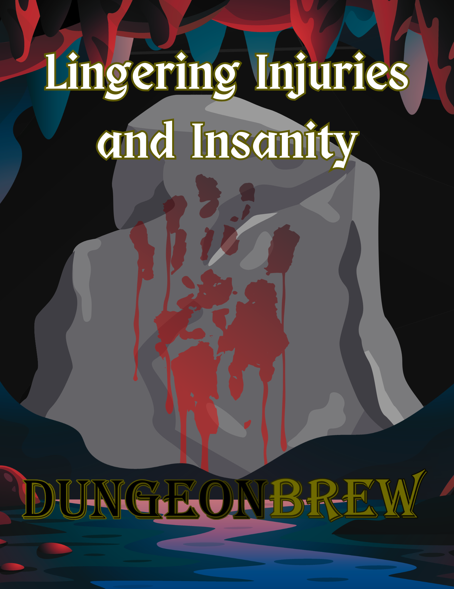

# Lingering Injuries & Insanity

Lingering Injuries & Insanity provides two d100 tables for adding lasting physical and psychological consequences to your game. Physical injuries range from lost fingers to broken backs, while the insanity table covers tics, phobias, paranoia, and worse. Both systems include scaling severity tiers (Fluff, Realistic, Brutal, Deadly) so GMs can dial the lethality to match their table's comfort level.

### Download the PDF

<a href="../downloads/lingering_injuries_and_insanity.pdf" download class="md-button">Download Lingering Injuries & Insanity (PDF)</a>

!!! quote ""
	***Using these charts in any form requires clear communication between the GM and players, as players can feel as though they are being punished, their characters are being changed or altered from their intended concept, or simply that it isn't fun. Make sure your group is on board for this type of play.***

---

## Lingering Injuries

Physical injuries are devastating and can represent the end of an adventurer's career. Broken bones, lost appendages, or festering wounds that require long periods of recovery or powerful magical healing offer a dose of realism to the degree of physical harm found in the world.

The cause of a physical injury can vary based on the type of game you are playing and the type of world you want represented by these injuries. Are injuries meant to act as a gentle reminder for the PCs or are they a brutal reality that must be dealt with in every combat encounter?

### Causes

**Fluff.** Injuries only occur with character death and are healed as a part of resurrection in most cases.

**Realistic.** Injuries occur when a character reaches 0 hp. Minor injuries are usually healed when the character is healed back to consciousness and are mostly only a threat in Tier I play, but can require valuable resources even at high levels.

**Brutal.** Injuries occur any time a character receives a critical hit, critically fails a save against a damage source, or reaches 0 hp. Resources are required in nearly every combat encounter to keep characters healthy and useful.

**Deadly.** Injuries can occur with every blow. If a character is damaged, they must make a Constitution saving throw against either a DC 10 or half of the damage taken, whichever is greater, or roll for an injury. Regular injuries will always be a threat, particularly against high damage opponents that almost always guarantee failure.

### Injury Table (d100)

| d100 | Injury |
|:---:|:---|
| 1 | **Lose Your Left Eye.** You have disadvantage on Wisdom (Perception) checks that rely on sight and on ranged attack rolls. Magic such as the *regenerate* spell can restore the lost eye. If you have no eyes left after sustaining this injury, you're blinded. |
| 2 | **Lose Your Right Eye.** You have disadvantage on Wisdom (Perception) checks that rely on sight and on ranged attack rolls. Magic such as the *regenerate* spell can restore the lost eye. If you have no eyes left after sustaining this injury, you're blinded. |
| 3–5 | **Close Call!** |
| 6 | **Lose Your Left Hand.** You can no longer hold anything with two hands, and you can hold only a single object at a time. Magic such as the *regenerate* spell can restore the lost appendage. A prosthesis can be attached to reduce the impact of the injury. |
| 7 | **Lose Your Right Hand.** You can no longer hold anything with two hands, and you can hold only a single object at a time. Magic such as the *regenerate* spell can restore the lost appendage. A prosthesis can be attached to reduce the impact of the injury. |
| 8–10 | **Close Call!** |
| 11 | **Lose Your Left Foot.** Your walking speed is halved, and you must use a cane or crutch to move unless you have a peg leg or other prosthesis. You must succeed on a DC 15 Dexterity saving throw or fall prone after using the Dash action. A character who spends one year with a prosthesis or advances 5 levels has learned to move normally with their handicap. You have disadvantage on Dexterity checks made to balance. Magic such as the *regenerate* spell can restore the lost appendage. |
| 12 | **Lose Your Right Foot.** Your walking speed is halved, and you must use a cane or crutch to move unless you have a peg leg or other prosthesis. You must succeed on a DC 15 Dexterity saving throw or fall prone after using the Dash action. A character who spends one year with a prosthesis or advances 5 levels has learned to move normally with their handicap. You have disadvantage on Dexterity checks made to balance. Magic such as the *regenerate* spell can restore the lost appendage. |
| 13–15 | **Close Call!** |
| 16 | **Punctured Lung.** You can take either an action or a bonus action on your turn, but not both. The injury heals if you receive 10 points of magical healing of 2nd level or higher. If you puncture both lungs your hit points drop to 0 and you immediately begin making death saving throws at disadvantage. |
| 17–18 | **Lose a Finger.** You have disadvantage on Dexterity (Sleight of Hand) checks and Dexterity checks to use fine tools (such as thieves' tools) using the hand with which you lost the finger. Magic such as the *regenerate* spell can restore the lost finger. If you lose all the fingers from one hand, then it functions as if you had lost a hand. Roll a d10, starting with your left pinky finger and counting across to determine which finger is lost. |
| 19–20 | **Close Call!** |
| 21 | **Lose Your Left Ear.** You have disadvantage on Wisdom (Perception) checks that rely on hearing. You have advantage on Charisma (Intimidation) checks. Magic such as the *regenerate* spell can restore the lost ear. If you have no ears left after sustaining this injury, you're deafened. |
| 22 | **Lose Your Right Ear.** You have disadvantage on Wisdom (Perception) checks that rely on hearing. You have advantage on Charisma (Intimidation) checks. Magic such as the *regenerate* spell can restore the lost ear. If you have no ears left after sustaining this injury, you're deafened. |
| 23 | **Lose Your Nose.** You have disadvantage on Charisma (Persuasion) checks and Wisdom (Perception) checks that rely on smell. You have advantage on Charisma (Intimidation) checks. Magic such as the *regenerate* spell can restore the lost nose. |
| 24–25 | **Close Call!** |
| 26 | **Blurred Vision.** You have disadvantage on Wisdom (Perception) checks that rely on sight and on ranged attack rolls. The injury heals if you receive magical healing. Alternatively, the injury heals after you spend three days doing nothing but resting. |
| 27 | **Break Your Left Arm.** You can no longer hold anything with two hands, and you can hold only a single object at a time. The injury heals if you receive magical healing of 3rd level or higher. Alternatively, the injury heals after someone sets the bone with a DC 15 Wisdom (Medicine) check and you spend thirty days doing nothing but resting. |
| 28 | **Break Your Right Arm.** You can no longer hold anything with two hands, and you can hold only a single object at a time. The injury heals if you receive magical healing of 3rd level or higher. Alternatively, the injury heals after someone sets the bone with a DC 15 Wisdom (Medicine) check and you spend thirty days doing nothing but resting. |
| 29–30 | **Close Call!** |
| 31 | **Break Your Left Leg.** Your walking speed is halved and you must use a cane or crutch to move. You fall prone after using the Dash action. You have disadvantage on Dexterity checks made to balance. The injury heals if you receive magical healing of 3rd level or higher. Alternatively, the injury heals after someone sets the bone with a DC 15 Wisdom (Medicine) check and you spend thirty days doing nothing but resting. |
| 32 | **Break Your Right Leg.** Your walking speed is halved and you must use a cane or crutch to move. You fall prone after using the Dash action. You have disadvantage on Dexterity checks made to balance. The injury heals if you receive magical healing of 3rd level or higher. Alternatively, the injury heals after someone sets the bone with a DC 15 Wisdom (Medicine) check and you spend thirty days doing nothing but resting. |
| 33 | **Ringing Ears.** You have disadvantage on Wisdom (Perception) checks that rely on hearing. The injury heals if you receive magical healing. Alternatively, the injury heals after you spend three days doing nothing but resting. |
| 34–35 | **Close Call!** |
| 36–37 | **Limp.** Your walking speed is reduced by 5 feet. You must make a DC 10 Dexterity saving throw after using the Dash action. If you fail the save, you fall prone. Magical healing of 3rd level or higher removes the limp. |
| 38 | **Teeth Knocked Out.** You have disadvantage on Charisma (Persuasion) checks. When you cast a spell with a verbal component there is a 25% chance the spell will not work. If the spell fails, you still used your action to try to cast it, but the spell did not use any slots or material components. The injury heals if you receive magical healing of 3rd level or higher or you possess a prosthesis. |
| 39–40 | **Close Call!** |
| 41 | **Cracked Sternum.** You have trouble breathing due to pain and can take either an action or a bonus action on your turn, but not both. Whenever you attempt an action in combat, you must make a DC 10 Constitution saving throw. On a failed save, you lose your action and can't use reactions until the start of your next turn. The injury heals if you receive magical healing of 3rd level or higher or if you spend ten days doing nothing but resting. |
| 42–43 | **Skull Fracture.** Whenever you attempt an action in combat, you must make a DC 15 Constitution saving throw. On a failed save, you lose your action and can't use reactions until the start of your next turn. The injury heals if you receive magical healing of 3rd level or higher or if you spend thirty days doing nothing but resting. |
| 44–45 | **Close Call!** |
| 46–47 | **Left Leg Bruised to the Bone.** You have sustained a blow that injured the muscle in your leg. You experience temporary pain, reducing mobility and resulting in disadvantage on any Acrobatics or Athletics checks that require the use of your legs. Magical healing removes the limp or it heals if you spend three days doing nothing but resting. |
| 48–49 | **Right Leg Bruised to the Bone.** You have sustained a blow that injured the muscle in your leg. You experience temporary pain, reducing mobility and resulting in disadvantage on any Acrobatics or Athletics checks that require the use of your legs. Magical healing removes the limp or it heals if you spend three days doing nothing but resting. |
| 50 | **Left Arm Bruised to the Bone.** You have sustained a blow that injured the muscle in your arm. You experience temporary pain, resulting in disadvantage on any Acrobatics or Athletics checks that require the use of your arms. Magical healing removes the pain or it heals if you spend three days doing nothing but resting. |
| 51 | **Right Arm Bruised to the Bone.** You have sustained a blow that injured the muscle in your arm. You experience temporary pain, resulting in disadvantage on any Acrobatics or Athletics checks that require the use of your arms. Magical healing removes the pain or it heals if you spend three days doing nothing but resting. |
| 52–53 | **Close Call!** |
| 54–56 | **Left Shoulder Dislocated.** You can no longer hold anything with two hands, and you can hold only a single object at a time. A DC 15 Wisdom (Medicine) check is required to pop your shoulder back into place before it can be healed. The injury heals if you receive magical healing or you spend three days doing nothing but resting. |
| 57–59 | **Right Shoulder Dislocated.** You can no longer hold anything with two hands, and you can hold only a single object at a time. A DC 15 Wisdom (Medicine) check is required to pop your shoulder back into place before it can be healed. The injury heals if you receive magical healing or you spend three days doing nothing but resting. |
| 60–61 | **Close Call!** |
| 62–64 | **Broken Ribs.** Whenever you attempt an action in combat, you must make a DC 10 Constitution saving throw. On a failed save, you lose your action and can't use reactions until the start of your next turn. The injury heals if you receive magical healing of 3rd level or higher or if you spend ten days doing nothing but resting. |
| 65–66 | **Festering Wound.** Your hit point maximum is reduced by 1 every 24 hours the wound persists. If your hit point maximum drops to 0, you die. The injury heals if you receive magical healing that cures diseases, such as *lesser restoration*. Alternatively, someone can tend to the wound and make a DC 15 Wisdom (Medicine) check once every 24 hours. After ten successes, the injury heals. |
| 67–70 | **Close Call!** |
| 71–73 | **Open Wound.** You lose 1 hit point every hour the wound persists. The injury heals if you receive magical healing of 2nd level or higher. Alternatively, someone can tend to the wound and make a DC 15 Wisdom (Medicine) check once every hour. After ten successes, the injury heals. |
| 74–76 | **Internal Injury.** Whenever you attempt an action in combat, you must make a DC 15 Constitution saving throw. On a failed save, you lose your action and can't use reactions until the start of your next turn. The injury heals if you receive magical healing of 3rd level or higher or if you spend ten days doing nothing but resting. |
| 77–80 | **Close Call!** |
| 81–82 | **Horrible Scar.** You have disadvantage on Charisma (Persuasion) checks and advantage on Charisma (Intimidation) checks. Magical healing of 6th level or higher, such as *heal* and *regenerate*, removes the injury. |
| 83–85 | **Painful Scar.** You have a scar which gets painful whenever it rains, sleets, hails, or snows. Whenever you attempt an action in combat and your scar is giving you pain, you must make a DC 15 Constitution saving throw. On a failed save, you lose your action and can't use reactions until the start of your next turn. Magical healing of 6th level or higher, such as *heal* and *regenerate*, removes the injury. |
| 86–99 | **Minor Scar.** The scar doesn't have any adverse effect, but chicks dig it. Magical healing of 6th level or higher, such as *heal* and *regenerate*, removes the scar. |
| 100 | **Broken Back.** Irreversible damage to your spine has made you a cripple. You are paralyzed from the waist down. Magical healing of 6th level or higher, such as *heal* and *regenerate*, can restore the use of your legs. |

## Lingering Insanity

Insanity is a character-altering mechanic that can quickly change the course of gameplay in such a way that the adventure or campaign must take a backseat to the altered worldview of the characters. Insanity rules are intended to help bring to life dark, deadly, or horrific campaign settings to help solidify the harsh reality the characters find themselves in.

### Causes

**Fluff.** Insanity only occurs with character death and is always a minimum duration that is generally resolved in short order.

**Realistic.** Insanity occurs when a character reaches 0 hp or when they fail a save that affects their emotional or mental state, such as fear or hideous laughter.

**Brutal.** Insanity occurs any time a character receives a critical hit, critically fails a save against a damage source, reaches 0 hp, or when they fail a save that affects their emotional or mental state.

**Deadly.** In addition to Brutal, if a character is damaged, they must make a Wisdom saving throw against either a DC 10 or half of the damage taken, whichever is greater, or roll for insanity.

### Duration

The duration of insanity should increase with additional instances. If a character is not currently affected by insanity, they must roll on the chart and be affected for a Short (1 hour) duration. If they are already affected by insanity, they do not roll, but instead increase the duration by one unit for each instance or failure: Medium (24 hours), Long (1 week), Indefinite (Permanent).

### Insanity Table (d100)

| d100 | Insanity |
|:---:|:---|
| 1–5 | **Simple Motor Tic.** You develop one or more compulsive sudden, brief, meaningless movements, such as eye blinking, head jerking, or shoulder shrugging. Motor tics can be of an endless variety and may include such movements as hand clapping, neck stretching, mouth movements, head, arm or leg jerks, and facial grimacing. You have disadvantage on Charisma checks that last more than 1 minute. |
| 6–8 | **Simple Phonic Tic.** You develop a compulsive sound or noise, with common vocal tics being throat clearing, sniffing, or grunting. You have disadvantage on Charisma checks that last more than 1 minute. |
| 9–13 | **Complex Motor Tic.** You develop a compulsive cluster of movements that appear coordinated. Examples include pulling at clothes, touching people, touching objects, echopraxia (repeating another person's actions), and copropraxia (involuntarily performing obscene or forbidden gestures). You have disadvantage on Charisma checks. |
| 14–16 | **Complex Phonic Tic.** You develop a compulsive complex sound or noise, which might include echolalia (repeating words just spoken by someone else), palilalia (repeating one's own previously spoken words), lexilalia (repeating words after reading them), coprolalia (the spontaneous utterance of socially objectionable or taboo words or phrases), or klazomania (compulsive shouting). Roll 2d3−1 to determine which tic you exhibit. You have disadvantage on Charisma checks. |
| 17–20 | **Object Obsession.** You become obsessed with one object in your possession as determined by your GM. If this object is not in your possession, you have disadvantage on all rolls until it is returned to you. |
| 21–24 | **Individual Obsession.** You become obsessed with one person you have encountered in the past. If you do not speak to this person at least once per day, you become irrational, irritated, and angry resulting in disadvantage on all rolls until you speak with them again. |
| 25–30 | **Emotional Incontinence.** You are plagued by uncontrollable episodes of crying, laughing, or other emotional displays. Your mood is incongruent with the actual emotion you are feeling, such as laughing while angry. Additionally, one emotion may drastically change into another, such as sobbing in the middle of a fit of laughter. You have disadvantage on Charisma checks requiring emotional appeals and anytime you are subject to a save that alters your emotional state, roll 1d4 to determine the emotion you actually feel (1. Anger 2. Fear 3. Joy 4. Despair). Roll again to determine the emotion you display. |
| 31–34 | **Multiple Personality.** You have developed another identity to cope with the stress you are feeling. Your race remains the same, but you must randomly roll a new background along with the Traits, Ideals, Bonds, and Flaws. Each time you roll this Insanity, roll a new personality. Once per hour, randomly roll to determine your personality. |
| 35–36 | **Amnesia.** You have forgotten who you are. You cannot remember your friends, family, or acquaintances. You retain all of your skills and abilities, but everything else is a blur. |
| 37–42 | **Alcoholic.** Alcohol keeps you sane. You need to maintain a constant state of inebriation to function. You must make a Constitution saving throw of DC 15 +1 for each hour you are sober, while not sleeping, or gain 1 level of exhaustion. |
| 43–47 | **Pathological Liar.** You cannot tell the truth, no matter how hard you try. You feel compelled to exaggerate or bend the truth even in small ways to make whatever you say seem more interesting to other people. |
| 48–50 | **Egotist.** You are the center of your own reality and you are interested purely in satisfying your own needs. You are never happy with your position, your relationships, or the events surrounding you. You feel you deserve more than what you have and no one else is worthy of what they have. |
| 51–52 | **Narcissist.** You are the smartest, wisest, strongest, fastest, and most beautiful person you know. You ignore any conversation that doesn't involve your favorite subject: you. You live in an imaginary world in which you are the only real inhabitant and cannot understand or cope with other people. Your primary expectation is that others will treat you with the same admiration, love, and attention with which you treat yourself. |
| 53–57 | **Delusional.** You believe you possess some special feature as determined by the GM. This feature can be anything from exceptional strength to the ability to breathe under water. While affected by this delusion, you behave in a manner consistent with the feature you have. If you roll this Insanity more than once, you are affected by another delusion. |
| 58–60 | **Irrational.** You do not use recognizable reason when making decisions, relying on your own peculiar vision of reality to determine the best course of action. In battle, you may decide to attack the creature with the smallest feet and on the next round decide to hold your action to belch in another creature's face. These decisions should appear to have no discernible rhyme or reason. |
| 61–65 | **Pessimist.** You believe that the worst will happen. You and your allies will die, the world will crumble, and every plan will fail. You expect any plans to fix the failed plan will fail as well. You have disadvantage on Wisdom saving throws. |
| 66–70 | **Optimist.** You believe everything will work itself out in the end. No matter what happens, you will see your way through to victory and success in all things. You ignore obstacles and assume you will just figure things out. You have disadvantage on Perception and Insight checks. |
| 71–74 | **Phobia.** You have a crippling fear of something. Your specific fear results in immediate panic, causing disadvantage on all rolls while it is within sight. Roll 1d4 to determine the type of phobia you have (1. Environmental 2. Creature 3. Medical 4. Situational). Your GM will determine your specific type of fear. |
| 75–78 | **Misanthropist.** You have developed a hatred for your own people. As a result, you have no compassion for their well-being and, in some cases, actively attempt to thwart their attempts at success and happiness. |
| 79–80 | **Cannibal.** You have developed a taste for the flesh of your own kind. The specific reasons for this practice are yours alone, but ultimately you cannot help yourself. At least once per week you must dine on the flesh of your own people. If you don't, you must roll on this table again and become afflicted by that Insanity until you do. |
| 81–82 | **Anxiety.** You are plagued by a continuous feeling of worry. You feel irritable, restless, and have problems with concentration. You have advantage on Initiative rolls, but disadvantage on any check that requires being calm or even-tempered such as crafting checks, stealth checks, Concentration saves, or others as determined by the GM. |
| 83–88 | **Mild Paranoia.** You believe that you are being watched by someone or something, most likely a creature you have come into contact with before. You avoid interacting with people you do not already know and refuse to sleep in unfamiliar locations without extensive preparation. |
| 89–92 | **Moderate Paranoia.** You are certain that others are out to get you and waver in your trust of those you have known for years. Only close family are free from your scrutiny, unless they have been absent for any period of time. You refuse food and drink if you did not see its preparation and sleep in a hidden location you reveal to no one. |
| 93–94 | **Severe Paranoia.** You trust no one. Even close family could be working for the enemy. You avoid communicating in common languages, even going insofar as to creating your own or not speaking at all. You are convinced you are constantly being watched and anyone who surprises you or you don't trust is usually met with violence. |
| 95–96 | **Post-Traumatic Stress Disorder.** You have experienced or witnessed a terrifying event. You have disadvantage on saving throws against fear when reminded of the event in any way and instead of the normal effects of the Frightened condition, you become enraged, attacking the nearest creature until you succeed on the saving throw. |
| 97–98 | **Masochist.** You revel in feeling pain. The sight of your own blood, the feeling of intense pain, or humiliation brings you gratification. If necessary, you will harm yourself, but it is a poor replacement for the real thing. You have resistance to bludgeoning, slashing, and piercing damage, but have disadvantage on defense rolls. |
| 99–100 | **Sadist.** You enjoy the pain of others. You derive pleasure from witnessing the suffering of other creatures. You will target anything from animals to people if needed. You go out of your way to see others harmed and will risk your own safety and well-being to see their pain. You add your proficiency to damage rolls against sentient creatures that can feel pain, but subtract it from creatures that don't. |
